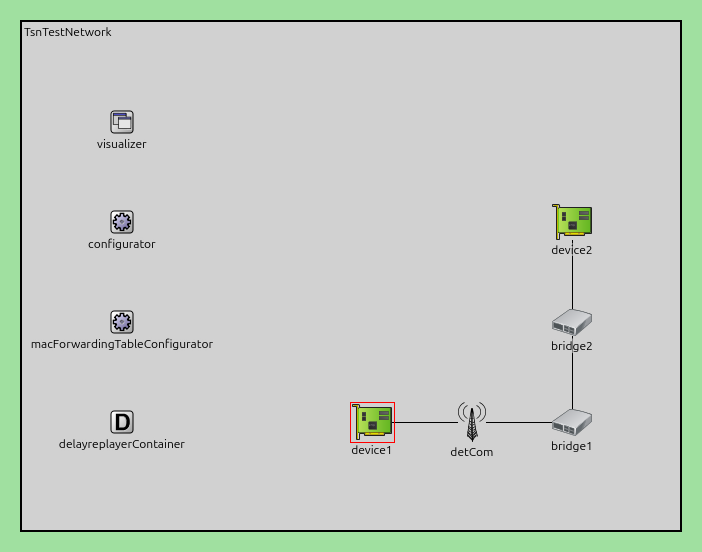
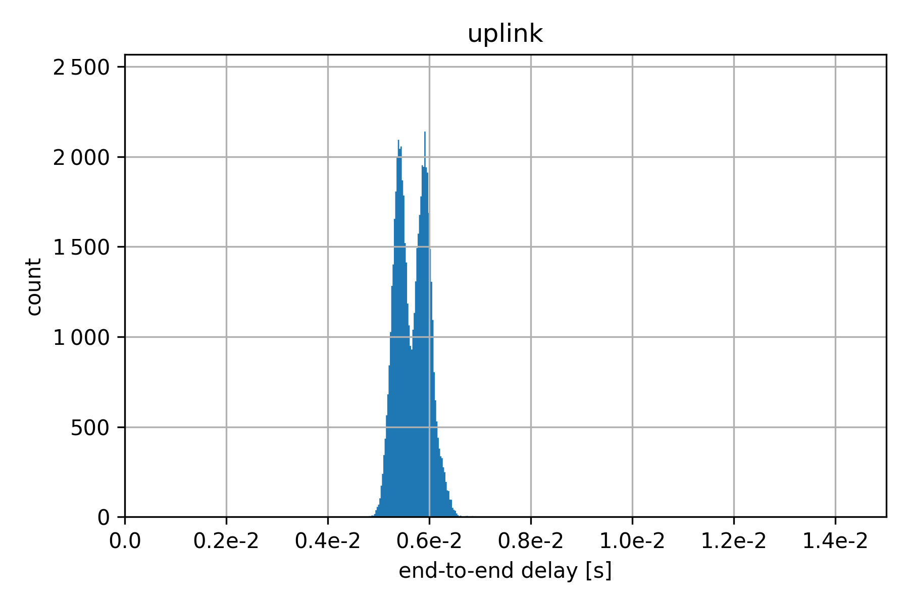
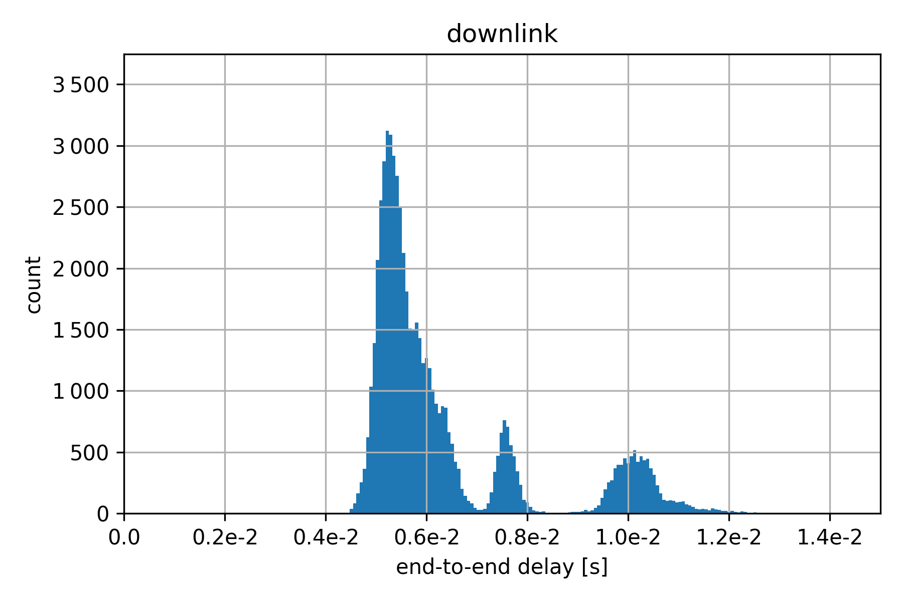
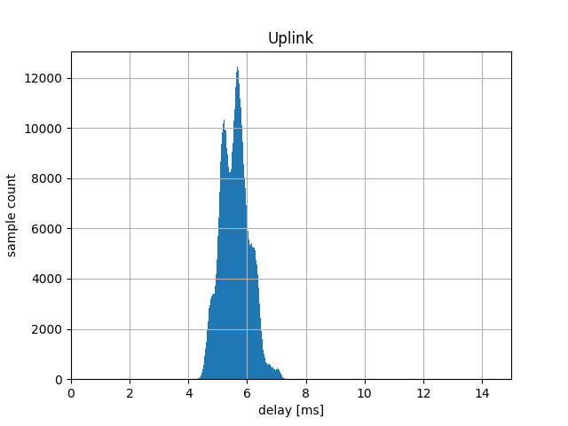
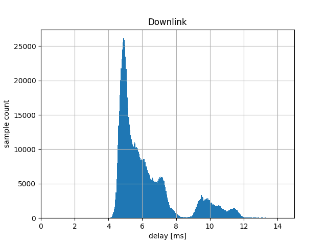

Delayreplayer Showcase
======================

To simulate real-world delay patterns in communication networks, we implemented a new component for the simulator.
This showcase demonstrates how to use the :ned:`DelayReplayer` and :ned:`DelayReplayerContainer` components to replay delay traces in a simulation scenario.

Showcase Design and Implementation
----------------------------------

The following figure shows the design of the showcase scenario.

The network consists of two devices connected via switches and a wireless link, as defined in the TsnTestNetwork.
The DelayReplayerContainer module is included to provide delay patterns from CSV files.

Here is an example configuration file:

.. literalinclude:: ../omnetpp.ini
    :language: ini
    :start-at: delayreplayerContainer
    :end-at: delayDownlink

As mentioned above, the DelayReplayer supports two modes.
The first mode, called cycle mode, requires a configuration file with one delay value per line.
In this mode, the delay values are picked in order, i.e., the first frame is delayed by the value given in the first line, the second frame is delayed by the value in the second line, and so on.
An optional offset can be applied, this offset allows to start the cycle at a specific position in the file.

In the second mode, called timestamped mode, a file with two comma-separated values per line is required.
The first value corresponds to a delay value, as before, and the second value corresponds to a timestamp.
In this case, if a frame arrives, the current simulation timestamp will be taken and the delay value of the closest smaller timestamp of the file will be taken.
As before, an offset can be specified.
In the example configuration above, a time of 5 ms would be added to the current simulation time before selecting the correct delay from the file.

Results
-------

The following figures show the comparison of a histogram from two given input histograms on the top
compared to the produced end-to-end packet delay of the simulation on the bottom using the raw measurement data of the same dataset
to configure the DelayReplayer.
The left side uses the timestamped mode, the right side uses the cycle mode.

+-------------+---------------+
| |uplink_in| | |downlink_in| |
| |uplink|    | |downlink|    |
+-------------+---------------+

This shows that the approach follows the delay traces and for a long-running simulation produces the same delay histograms.
As expected, input and output histograms form a similar distribution, but as the simulation only covers a small timeframe of the whole dataset,
they are not exactly the same.