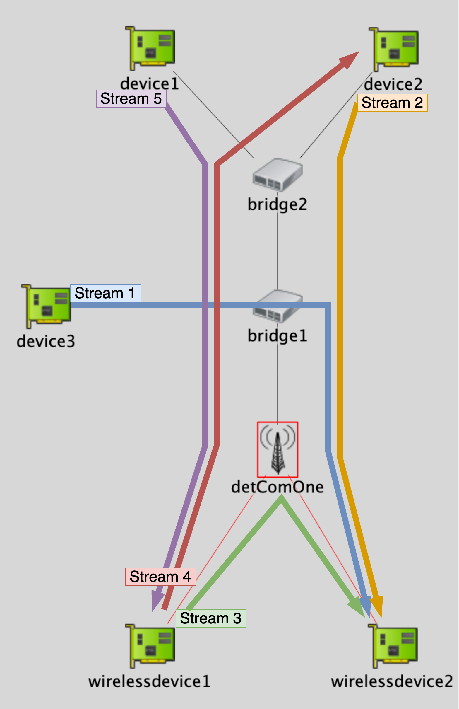

Dynamic Scenario Showcase
=========================

In this showcase we demonstrate our direct scheduler interface for simulating dynamic scenarios.
Part of this showcase is a python dummy scheduler which already contains the result files for this scenario.
These result files were generated by a real scheduler, but to allow for a quick use of the showcase without the need
of specific setup, it is not included in the repository.

Scenario
--------

This scenario consists of the following network with the streams shown in the following figure:

Stream Setup
------------

Every stream in our DynamicScenario needs to use the :ned:`DynamicPackerSource` module as a source.
Please refer to this documentation for more information on how the configuration parameters of this app.
An example configuration for one stream is provided in the following:

.. literalinclude:: ../omnetpp.ini
    :language: ini
    :start-at: wirelessdevice2
    :end-at: objectiveType

Scheduler Setup
---------------

The scheduler setup is performed in the :ned:`ExternalGateSchedulingConfigurator` module.
If you want to use your own scheduler please note to set the ``SCHEDULER_ROOT`` environment variable to the path of your scheduler.
The scheduler can be any program as long as it takes the files in the correct format and produces the correct output files.

There are three input files:

- ``networkFile`` Defines the file path where the file defining the network topology is stored.
- ``streamsFile`` Defines the file path where the file defining the stream requirements is stored.
- ``histogramsFile`` Defines the file path where a file containing all delay distributions is stored.

And one output file:

- ``configurationFile`` Defines the file path where the scheduler outputs its calculated TSN schedule.

The example configuration of the dummy scheduler is shown in the following:

.. literalinclude:: ../omnetpp.ini
    :language: ini
    :start-at: .command
    :end-at: .histogramsFile

Dynamic Scenario and Results
----------------------------

The :ned:`ChangeMonitor` module is responsible for monitoring the changes of histograms and streams.
Please refer to the documentation of this module for more information on how to configure it.

The dynamics of the scenario are defined using INETs ScenarioManager.
The following code shows the example of our example dynamic scenario.

.. literalinclude:: ../scripts/dyn-changes.xml
    :language: xml
    :start-at: stop
    :end-at: <!-- end
    :dedent: 4

The following figure shows the resulting end-to-end delay:

.. image:: end-to-end\ delay.png

In this example this happens:

1. At ``t=20 s``, stream2 requests to stop its stream. After the execution of the scheduler, the stream is stopped, which is visible in the results by the ending orange line. At the same time the scheduler   re-schedules stream3 resulting in a change of its end-to-end delay.
2. At ``t=40 s``, stream3 wants to increase the production interval and packet size. This again leads to a re-scheduling of stream3 resulting in the change of its end-to-end delay.
3. At ``t=50 s``, the downlink histogram of dstt1 improves (shifting 1 ms to the left), while the uplink histogram of dstt0 degrades (shifting 1 ms to the right) resulting in rescheduling of stream3 and stream4.
4. At ``t=60 s``, stream1 requests to start sending new data, while at the same time stream3 immediately stops sending data. This becomes visible in the results by the ending green line and the newly starting blue line.
5. At ``t=80 s``, the downlink histogram of dstt0 improves (shifting 1 ms to the right), resulting in a reduced end-to-end delay for stream5
