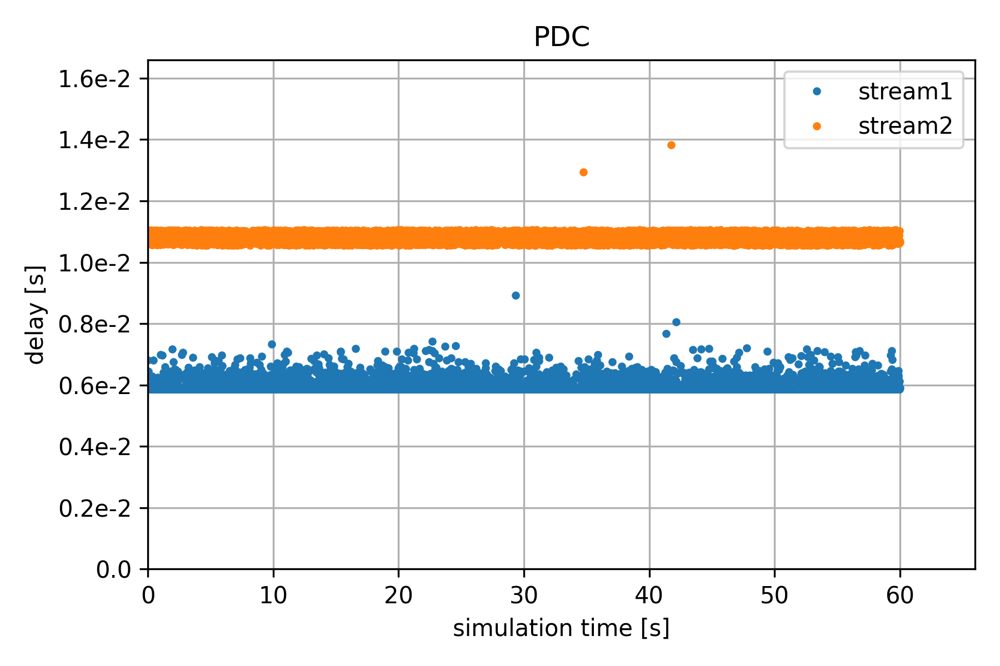

Packet Delay Correction (PDC) Showcase
======================================

In this section, we showcase the packet delay correction (PDC) mechanism.
There are multiple methods to implement PDC, namely a timestamp-based method and a virtual-timeslot-based method.

PDC Mechanism
-------------

In the timestamp-based method, the ingress point (DS-TT or NW-TT) attaches an ingress timestamp ``t_i`` to the packet.
The egress point (another DS-TT or NW-TT) then generates an egress timestamp t_e and uses both timestamps to generate a residence time
``t_res=t_e-t_i``. The egress point then removes the ingress timestamp from the packet and holds the packet for time
``t_hold=pdc-t_res`` where ``pdc`` refers to a predefined minimum packet delay.
If ``pdc`` is equal to the maximum packet delay ``pd_max``, all frames spent exactly pd_max inside of the DetCom node.
If, however, ``pdc`` is smaller than ``pd_max``, the resulting Packet Delay Variation (PDV) is equal to the interval ``[pdc,pd_max]``.

The virtual-timeslot-based method works similarly to the timestamp-based method but instead of using precise timestamps
it uses timeslots of a predefined size ``T_slot`` and encodes the ingress and egress times using an integer number uniquely specifying a timeslot.
The egress TsnTranslator then calculates the number of timeslots to hold the frame and forwards the frame within the following timeslot.
This approach is able to achieve a PDV equal to ``T_slot``.

Our PDC function in the simulator is focused on the timestamp-based approach.

Configuration
-------------

The configuration of PDC works on a per-stream basis and is based on the streamIndentifier principle,
which is also used in INET to enable Per Stream Filtering and Policing (PSFP) and to map streams to PCP values.
The following code shows an example PDC configuration.
It contains two streams.
The PDC values of Stream 1 is chosen such that ``70 %`` of the frames from the expected interval are corrected.
Stream 2 is configured to correct ``99.99 %`` of the streams.
The jitter parameter allows to additionally specify a random delay that is added after correction.
This can be used to simulate the behavior of timeslots.
In this example, a uniform additional delay is selected from the interval ``[0ms,0.5ms]`` simulating a virtual-time-slot based approach with a time-slot length of ``500 μs``.

.. literalinclude:: ../omnetpp.ini
    :language: ini
    :start-at: hasPdc
    :end-at: jitter

Results
-------

The result of the above configuration is shown in the following figure:
The blue dots represent the delays of the frames of Stream 1, while the orange dots represent the delays of the frames of Stream 2.
As expected, the delays of Stream 1 form a line at ``5.82 ms`` as configured with some outliers above the line corresponding to the expected remaining ``30 %`` of the frames.
The delays of Stream2 form a line of width ``500 μs`` corresponding to the configured time-slot size.

